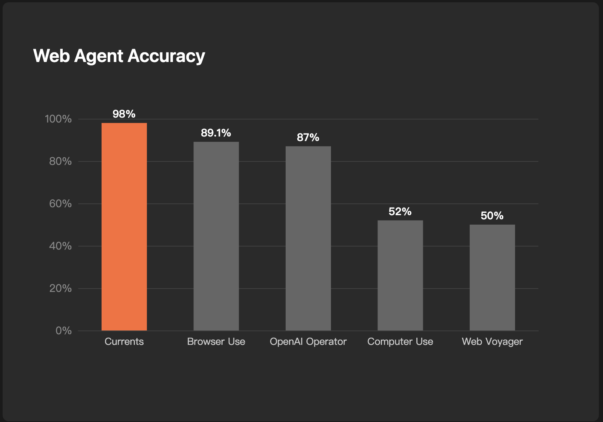

# Currents Web Agent

Currents Web Agent achieved **state-of-the-art (SOTA)** performance on the **WebVoyager** benchmark.  

Our system outperforms both browser-use (89%) and OpenAI Operator (87%), setting a new benchmark for web agent capabilities.
Beyond raw scores, Currents Web Agent demonstrates robust and consistent performance across all evaluated websites, including highly dynamic and interaction-heavy platforms such as Booking.com and Wolfram Alpha. This stability under complex conditions highlights the agent’s generalization ability and reliability in real-world environments, positioning it as a strong foundation for the next generation of web automation and reasoning systems.

## Results Overview

**Web Agent Accuracy**: **98%**

### Accuracy by Website (sorted high → low)

| Website              | Currents | Browser-use |
|----------------------|----------|-------------|
| Allrecipes           | 100.0%   | 90%         |
| Amazon               | 100.0%   | 92%         |
| Apple                | 100.0%   | 91%         |
| ArXiv                | 100.0%   | 83%         |
| BBC News             | 100.0%   | 91%         |
| Cambridge Dictionary | 100.0%   | 91%         |
| GitHub               | 100.0%   | 92%         |
| Google Flights       | 100.0%   | 95%         |
| Coursera             | 97.5%    | 90%         |
| ESPN                 | 97.5%    | 85%         |
| Google Search        | 97.5%    | 90%         |
| Google Map           | 97.4%    | 86%         |
| Huggingface          | 97.2%    | 100%        |
| Booking              | 92.5%    | 80%         |
| Wolfram Alpha        | 91.3%    | 83%         |

The results show that the web agent performs well even on complex and dynamically loaded websites such as Booking and Wolfram Alpha.

## Demos
**task1: Visit the store locator page to find out which Ace Hardware stores in California offer in-store pickup for online orders, then list the store names and addresses. Only use http://acehardware.com to achieve the task. Don't go to any other site. The task is achievable with just navigation from this site.**

_Currents found the store list:_

https://github.com/user-attachments/assets/02e18550-d109-4103-97dc-f0c5b9906649

_OpenAI Operator failed to found the store list:_

https://github.com/user-attachments/assets/cf737d1f-d8ce-42d9-b6ed-73a2b197a181

**task2: Visit Amazon.coms, search an Xbox Wireless controller with green color and rated above 4 stars.**

_Currents web agent found the green  Xbox Wireless controller_

https://github.com/user-attachments/assets/8e085713-1a20-4ada-8402-0e61e2626848

_Browser-Use failed to find an Xbox Wireless controller with green color_

https://github.com/user-attachments/assets/22423b6b-a011-4065-bd13-efa9f6939344

## Evaluation Methodology

We followed the same evaluation setup as described in the [Browser-use SOTA technical report](https://browser-use.com/posts/sota-technical-report), using the **same prompts** and the **same model** for fairness and comparability.

### Adjustments to Test Cases
- Many original test cases in WebVoyager have **expired or become outdated**.  
  - For example, in Booking.com tasks, the mentioned dates were already in the past, so we updated them to **future dates**.  
  - Some news, blogs, and websites had changed content or structure.  
- We modified **dozens of tasks** to ensure they remain executable.  
- The updated task set can be found in **`WebVoyager_data.jsonl`**.

### Evaluation Prompt Limitations
- The default WebVoyager evaluation prompt is not ideal.  
  - LLMs tend to mark answers as **“unknown”** or **“failed”** if the information in response is not visible in the screenshot.  
  - However, the screenshot primarily serves as **evidence that the agent actually executed the task**, rather than a strict source of truth.  
- For cases judged as “unknown” or “failed” by the LLM, we conducted **manual inspection** and **adjusted results** accordingly.  
- All adjustment records are stored in **`WebVoyager_eval.jsonl`**.

## Future Work

- **Benchmark freshness**: WebVoyager was introduced in **January 2024**. After more than a year, many tasks have become outdated, and the amount of manual adjustment required is significant. In the future, we plan to experiment with **newer and more frequently updated benchmarks**.
- **Higher task difficulty**: Since WebVoyager’s release in early 2024, **LLM agent technologies have advanced rapidly**. To better measure a web agent’s true capabilities, we need **more challenging tasks** that push the limits beyond current benchmarks.
- **Cross-site, long-horizon tasks**: We aim to develop benchmarks that include **multi-website, multi-step task chains**, providing a more realistic evaluation of an agent’s ability to handle complex real-world workflows.

